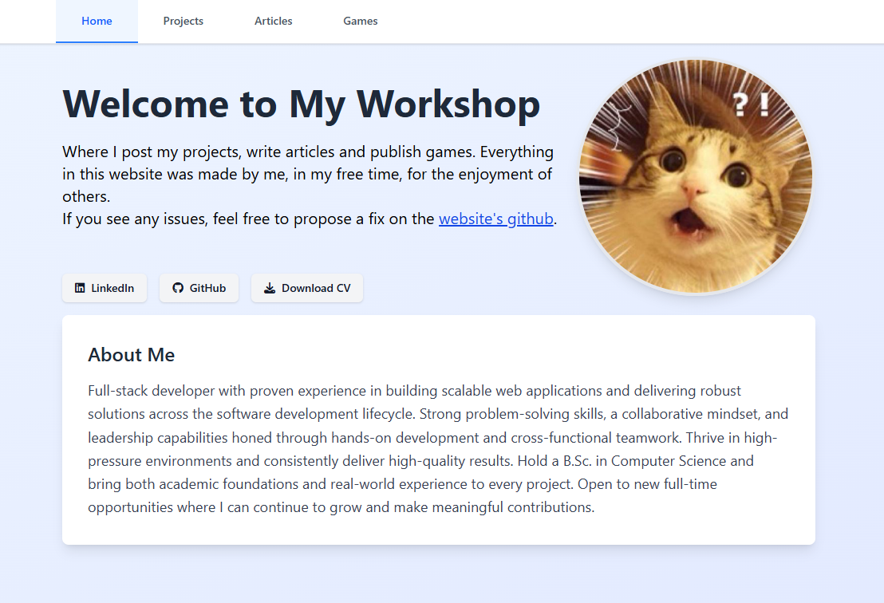

# My Website and Playground

Welcome to my website!

  

This website serves as a simple portfolio for my projects as well as a playground for me to test my projects and publish items there.

The website is work in progress, and will continue being a work in progress as long as I program!

## Tech Stack

- Astro
- TypeScript
- Tailwindcss

I chose Astro as I was looking for a framework that will let me natively render Markdown files. The reason I wanted that was to be able to create articles easily.  
I remember reading an article about an Entity Component System in C++ and the page looked like it was made with markdown, but a custom styled markdown. I thought it looked really amazing and also really nice - especially for a person who likes making programming/mathematics tutorials and posts.  
That is why I chose Astro.

TypeScript is an obvious choice for any JavaScript related development.

I chose Tailwind as I was in the mood of keeping everything self contained. Although some people might say that using Tailwind pollutes the code with uncessary class names. I believe once you get used to it it's a great tool to get things up and running quickly without having to navigate between files too much.  
Perfect for small and large scale applications.

## License

Everything on this page was written by me, you may share the website, but not pass it as your own.
